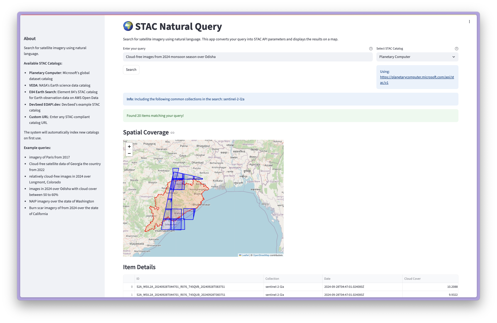

# 🌍 STAC Semantic Search

**Query STAC catalogs using natural language**

STAC Semantic Search allows users to find satellite imagery and geospatial data using natural language queries. Instead of crafting STAC API parameters themselves, users can simply describe what they're looking for in plain English.

## ✨ Features

- **Natural Language Search**: Ask questions like "Find cloudless Sentinel-2 imagery over Paris from 2023" 
- **Intelligent Query Processing**: AI-powered agents understand temporal, spatial, and collection-specific requirements
- **Vector-Based Collection Search**: Uses sentence transformers to find relevant data collections semantically
- **Interactive Web Interface**: Streamlit UI for easy exploration and visualization
- **STAC API Integration**: Works with any STAC-compliant catalog
- **Smart Filtering**: Automatically handles cloud cover, date ranges, and spatial extents
- **Visual Results**: Interactive maps showing search results and areas of interest


## 🚧 Early Prototype

This project is still in its very early stages and under active development. You might encounter some quirks or rough edges, but please give it a try and let us know what you think!


## 🚀 Getting Started

### Prerequisites

- OpenAI API key / Anthropic API key / Mistral API key (or any other LLM [supported by Pydantic AI](https://ai.pydantic.dev/models/))
- Docker and docker compose
- A STAC catalog to search through
- A [Geodini instance](https://github.com/sunu/geodini) to resolve geolocation queries


### Installation

1. **Clone the repository**
   ```bash
   git clone https://github.com/developmentseed/stac-semantic-search.git
   cd stac-semantic-search
   ```

2. **Set up environment variables**
   ```bash
   cp .env.example .env
   ```

3. **Build and run the application**

   ```bash
   docker compose up --build
   ```

4. **Access the application**

   - API: http://localhost:8000
   - Streamlit UI: http://localhost:18501

## 📖 Usage

### API Endpoints

**Search Collections**
```bash
curl -X POST "http://localhost:8000/search" \
     -H "Content-Type: application/json" \
     -d '{"query": "Sentinel-2 imagery"}'
```

**Search Items**
```bash
curl -X POST "http://localhost:8000/items/search" \
     -H "Content-Type: application/json" \
     -d '{"query": "cloudless imagery over Paris from 2023", "limit": 10}'
```

### Example Queries

- **Temporal**: "Find imagery from 2023"
- **Spatial**: "Show me imagery over New York City" 
- **Collection-specific**: "NAIP imagery over the state of California"
- **Attribute-based**: "Find cloudless imagery over Odisha with less than 10% cloud cover"
- **Complex**: "Sentinel-2 images of in California from summer 2023"

## 🧠 How It Works

### Query Processing Pipeline

1. **Query Analysis**: The system uses specialized AI agents to understand different aspects of your query:
   - **Temporal Agent**: Extracts date ranges and temporal constraints
   - **Spatial Agent**: Identifies locations and converts them to geographic coordinates
   - **Collection Agent**: Determines relevant data collections using vector similarity
   - **Filter Agent**: Creates appropriate STAC API filters (cloud cover, etc.)

2. **Vector Search**: Collection descriptions are embedded using sentence transformers and stored in ChromaDB for semantic search

3. **AI Reranking**: Results are intelligently reranked by an LLM based on relevance to the original query

4. **STAC API Integration**: Final parameters are used to query the actual STAC catalog for real data

### Supported STAC Catalogs

- Microsoft Planetary Computer (default)
- Any STAC-compliant catalog (configurable)

## 📸 Screenshots


